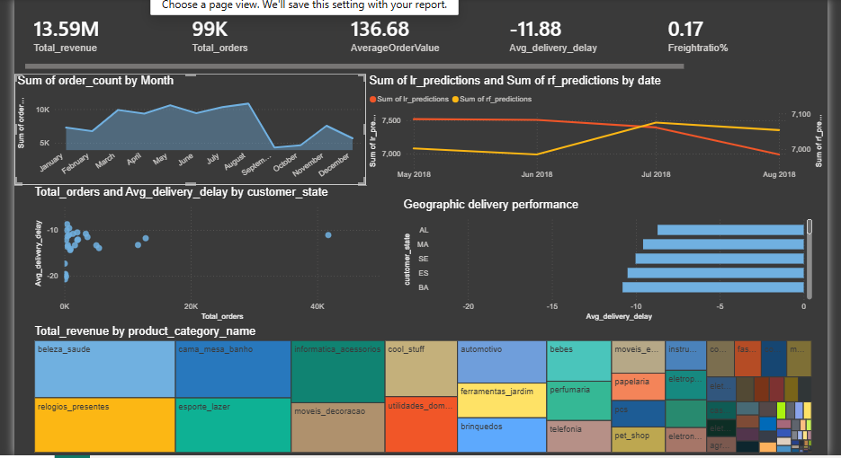

# Supply Chain Analytics Dashboard

## Project Overview

This project analyzes supply chain performance using the Olist e-commerce dataset.
The goal is to understand order trends, customer distribution, and product demand patterns to support data-driven supply chain decisions.

The analysis includes data cleaning, data preparation, and dashboard visualization using Power BI.

---
## Business Problem

E-commerce companies must efficiently manage inventory, deliveries, and customer demand to maintain a smooth supply chain. Poor demand forecasting or inefficient order processing can lead to delayed deliveries, stockouts, and customer dissatisfaction.

This project analyzes supply chain data from the Olist marketplace to identify order trends, product demand patterns, and operational performance metrics that can help improve supply chain decision-making.

---

## Dashboard Preview

---

## Key Insights

Order demand shows clear monthly fluctuations, indicating seasonal purchasing behavior on the platform.

A small number of product categories contribute to a large portion of total orders, highlighting key demand drivers.

Customer distribution varies significantly across regions, suggesting potential opportunities for targeted logistics and inventory planning.

Order-level analysis reveals patterns that can help improve demand forecasting and supply chain planning.

---

## Project Structure

data/raw
Original Olist dataset files.

data/processed
Cleaned datasets used for analysis and visualization.

notebooks
Python notebook used for data loading and preparation.

reports
Final Power BI dashboard file.

dashboard
Screenshot preview of the dashboard.

---

## Tools Used

* Python
* Pandas
* Power BI
* Jupyter Notebook

---

## ## Data Processing Steps

The raw Olist e-commerce datasets were processed using Python to prepare them for analysis and visualization.

Main steps included:

* Loading multiple datasets such as orders, customers, products, and order items.
* Cleaning missing values and removing inconsistent records.
* Creating structured datasets for customers, orders, and products.
* Generating aggregated datasets such as monthly demand trends for dashboard analysis.

---

## Author

Stuti Garg

---